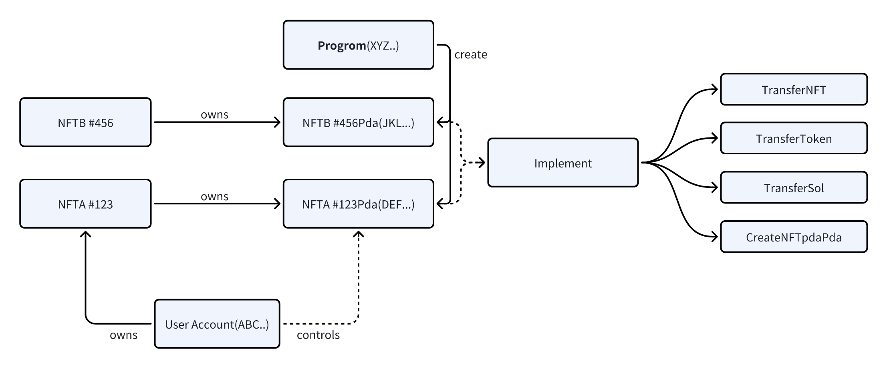

# solana-6551

## Abstract

Solana-6551 utilizes Solana's unique account model, permitting the creation of a unique Program Derived Account (PDA) for each NFT. allows NFTs to own assets and interact with applications, without requiring changes to existing smart contracts or infrastructure.

## Specification

### Overview

The system outlined in this proposal has two main components:

- Program to create PDA (Program-Derived Addresses) accounts for NFTs
- A common instructions for NFT_PDA implementations

The following diagram illustrates the relationship between NFTs, NFT holders, token bound pdas, implement, and the Program:


### Create NFT_PDA

Use nft_mint_address as a seeds to generate a unique NFT_PDA for each NFT,and store nft_mint_address in nft_pda.

```rust
#[account(
        init,
        payer = payer,
        space = 85,
        seeds = [
            b"nft_pda",
            nft_mint.key().as_ref(),
        ],
        bump
    )]
pub nft_pda: Account<'info, NftPda>
    
#[account]
pub struct NftPda {
    pub nft_mint: Pubkey,
    pub pda_num: u64,
}
```

### Transfer PDA NFT

The owner of the nft can transfer the NFT owned by the nft_pda

```rust
pub fn transfer_pda_nft(ctx: Context<TransferPdaNft>) -> Result<()> {
    let seeds = &[
        "nft_pda".as_bytes(),
        ctx.accounts.native_nft_token_account.mint.as_ref(),
        &[*ctx.bumps.get("nft_pda").unwrap()],
    ];
    let signer = &[&seeds[..]];

    transfer_token_with_signer(
        ctx.accounts.from_nft_token_account.to_account_info(),
        ctx.accounts.to_nft_token_account.to_account_info(),
        ctx.accounts.nft_pda.to_account_info(),
        ctx.accounts.token_program.to_account_info(),
        1,
        signer,
    )?;

    let log = json!({
        "Func":"transferPdaNft",
        "tokenAddress":&ctx.accounts.from_nft_token_account.mint.to_string(),
        "nftPda":&ctx.accounts.nft_pda.key().to_string(),
        "from":&ctx.accounts.payer.key().to_string(),
        "to":&ctx.accounts.to.key().to_string()
    });
    msg!("{}", serde_json::to_string(&log).unwrap());

    Ok(())
}
```

### Transfer PDA Token

The owner of the nft can transfer the Token(like USDC) owned by the nft_pda

```rust
pub fn transfer_pda_token(ctx: Context<TransferPdaToken>, amount: u64) -> Result<()> {
    let seeds = &[
        "nft_pda".as_bytes(),
        ctx.accounts.native_nft_token_account.mint.as_ref(),
        &[*ctx.bumps.get("nft_pda").unwrap()],
    ];
    let signer = &[&seeds[..]];

    transfer_token_with_signer(
        ctx.accounts.from_token_account.to_account_info(),
        ctx.accounts.to_token_account.to_account_info(),
        ctx.accounts.nft_pda.to_account_info(),
        ctx.accounts.token_program.to_account_info(),
        amount,
        signer,
    )?;

    let log = json!({
        "Func":"transferPdaToken",
        "tokenAddress":&ctx.accounts.from_token_account.mint.to_string(),
        "nftpda":&ctx.accounts.nft_pda.key().to_string(),
        "from":&ctx.accounts.payer.key().to_string(),
        "to":&ctx.accounts.to.key().to_string(),
        "amount":amount
    });
    msg!("{}", serde_json::to_string(&log).unwrap());

    Ok(())
}
```

### Transfer PDA Sol

The owner of the nft can transfer the Sol owned by the nft_pda

```rust
pub fn transfer_pda_sol(ctx: Context<TransferPdaSol>, amount: u64) -> Result<()> {

    transfer_sol_with_pda(
        ctx.accounts.nft_pda.to_account_info(),
        ctx.accounts.to.to_account_info(),
        amount,
    )?;

    let log = json!({
        "Func":"transferPdaSol",
        "nftpda":&ctx.accounts.nft_pda.key().to_string(),
        "from":&ctx.accounts.payer.key().to_string(),
        "to":&ctx.accounts.to.key().to_string(),
        "amount":amount
    });
    msg!("{}", serde_json::to_string(&log).unwrap());

    Ok(())
}
```

### Create NFT_PDA PDA

The owner of the nft can create nft_pda's PDA, and customize the content to be saved into the pda, all the content is on-chain

```rust
pub fn create_nftpda_pda(ctx: Context<CreateNftpdaPda>, content: String) -> Result<()> {
    let nftpda_pda = &mut ctx.accounts.nftpda_pda;
    nftpda_pda.content = content;
    nftpda_pda.nft_mint = ctx.accounts.native_nft_mint.key();

    let nft_pda = &mut ctx.accounts.nft_pda;
    nft_pda.pda_num += 1;

    let log = json!({
        "Func":"createNftpdaPda",
        "nftpdaPda":&ctx.accounts.nftpda_pda.key().to_string()
    });
    msg!("{}", serde_json::to_string(&log).unwrap());
    Ok(())
}

#[account]
pub struct NftpdaPda {
    pub nft_mint: Pubkey,
    pub content: String,
}
```

### Ownership

When the NFT is transferred, the ownership of the nft_pda belongs to the new NFT owner.There is no specific ownership record in NFTpda, only a comparison between the caller and the owner of the NFT when transferring nft_pda assets.

```rust
#[account(mut)]
    payer: Signer<'info>,

    #[account(
    seeds = [
    b"nft_pda",
    native_nft_mint.key().as_ref(),
    ],
    bump,
    )]
    nft_pda: Account<'info, NftPda>,

    #[account(constraint = nft_pda.nft_mint == native_nft_mint.key())]
    native_nft_mint: Account<'info, Mint>,

    #[account(mut, constraint = native_nft_token_account.amount == 1 
        && native_nft_token_account.owner == payer.key()
        && native_nft_token_account.mint == native_nft_mint.key())]
    native_nft_token_account: Account<'info, TokenAccount>,
```